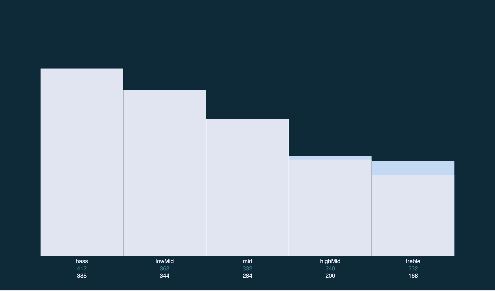

# VJ WebAPp Example
Reads (FFT) Data from Websocket and displays Frequencies Power. Makes use of p5js and http-server. 

*Example*



## Prequesites

1. before you start, make sure you have you have the websocket server running
check my other repository [pyaudio-fft-websocket-server](https://github.com/straczowski/pyaudio-fft-websocket-server)

2. Install Modules

```
npm install
```

# Run

Start Http-Server with

```
npm start
```

open `localhost:8080` in your browser 🐓 

